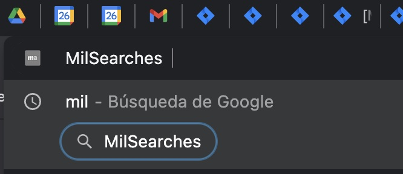
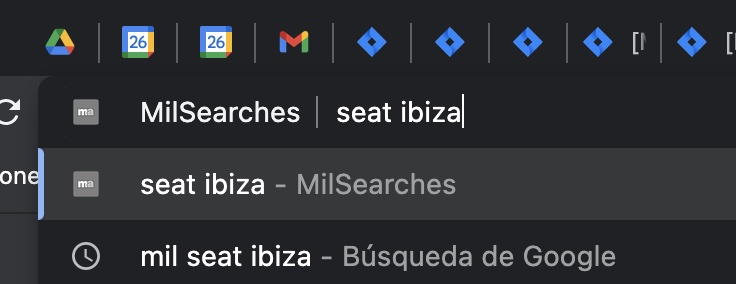

Experimental only for testing purposes
This info is public, you can access it from anywhere and it's used only for learning and testing purposes

# MilSearches Chrome extension

This extension is used to look for something into the MA page using the bar browser

## how is working

- write down into the omnibox browser bar 'mil' and click the 'tab' key
- keep on writing whatever you want to search into the MA page and click enter
- a new tab will be shown and you will see the keyword search into the MA page

