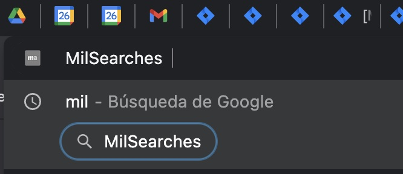
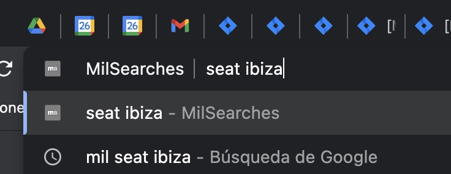

Experimental only for testing purposes
This info is public, you can access it from anywhere and it's used only for learning and testing purposes 

# X-Curl Chrome extension
This extension is used to look for something into the MA page using the bar browser

## how is working

- write down into the omnibox browser bar 'xcurl' and click the 'tab' key
- write down into the omnibox browser bar a valid endpoint name and queryparams starting with ?
- a new tab will be shown and you will see the endpoint execution

